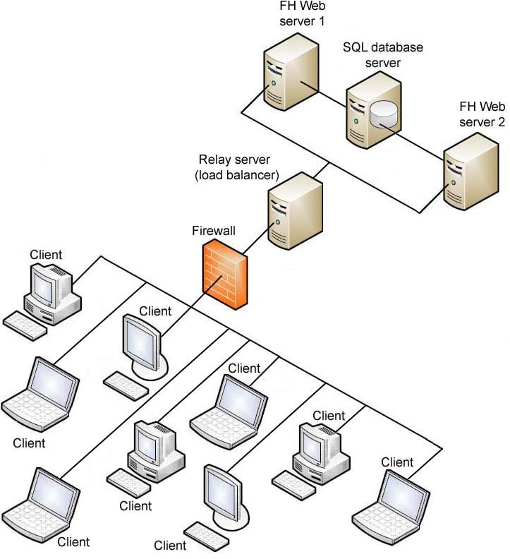

# Deliverable 1

## Questions
### 1. What is a web server?

A web server is the software that processes HTTP requests and serves web sites to clients. It runs on server hardware, either a physical or virtual machine, but the web server term itself usually refers to the software itself rather than the hardware it runs on.

### 2. What are some different web server applications?

#### Apache

A free an open source web server that was initially released in 1995. Uses a Multi-Processing Module (MPM) system, different strategies for handling connections. 

- prefork MPM: spawns individual processes for each event
- worker MPM: multiple threads for processes, memory efficient, handles multiple concurrent connections.
- event MPM: dedicates threads to active connections using events

* Website: https://apache.org
* Available for: Linux, Windows
* Latest Version: 2.4.65 Stable (released 2025-07-23)

#### nginx

nginx is a web server than can also be used as a reverse proxy, load balancer, mail proxy and HTTP cache. It is free and open source and used for high flexibility and performance settings. 

* Website: https://nginx.org/en/
* Available for: Linux, macOS, Windows
* Latest Version: 1.28.0 Stable (released 2025-04-23)

#### Caddy

Released in 2015, Written in Go, an efficient language for development and similar to the C language. HTTP/2 and HTTP/3 support out of the box. 

* Website: https://caddyserver.com
* Available for: Linux, Windows (chocolatey & scoop), macOS (homebrew)
* Latest Version:  2.10.0 Stable    (released 2025-4-18)

### 3. What is virtualization?

Virtualization is a technology that allows the division of computing resources in order to run a virtual device on the host machine. The virtual device is allocated its own part of the host's resources, the CPU, RAM, and storage. 

### 4. What is virtualbox?

Virtualbox is software offered by Oracle for x86-64 and ARM platforms. It was released under the terms of the GNU General Public license, and is free and open source, though the Extension Pack is proprietary software. 

### 5. What is a virtual machine?

A virtual machine is a software-based emulation of a physical computer that runs its own operating system and applications in isolation from the host system. The hypervisor allocates the host PC's hardware resources and presents them as virtualized resources. Can snapshot, clone, or delete the machine at will.

### 6. In the context of virtualization, what does host machine and guest machine mean?
* **Host Machine:** Physical computer in the virtualization process, runs the hypervisor. 

* **Guest Machine:** Virtual computer that borrows hardware resources: creates disk images to mimic storage, and runs on a virtual network through the host's network connection.

### 7. What is Debian?

Debian is a free operating system based on the Linux kernel using basic OS tools from the GNU project. It is one of the most common Linux distributions, most well known for its stability. Due to Debian being developed on a "when it's ready" schedule, it ensures that the amount of bugs and OS-breaking instabilities is as minimal as possible. This means that Debian is a top pick when choosing an OS to run for a server.

### 8. What is a firewall?

A firewall is a network security system that monitors and controls inbound and outbound traffic based on security rules set in the system. It acts as a barrier between trusted internal networks and untrusted external networks, filtering packets according to defined policies. It can be hardware based, software based, or both. 

### 9. What is SSH?

SSH stands for "Secure Shell," an encrypted remote access protocol that replaced telnet. Uses public key cryptography, where the public key is placed on servers and the private key stays secret. Does tunneling, file transfers, and port forwarding.

### 10. What is an IP Address?

An IP address is a unique numerical identifier assigned to each device on a network using Internet Protocol. It serves two primary functions: identifying the host network or network interface, and providing the location of the device in the network to route data packets between source and destination. Assigned by DHCP and can be in the IPv4 (32 bit) or IPv6 (128 bit) format. 

### 11. What is a network mask?

A network mask or subnet mask is how a computer defines which part of the IP address is the network portion and which is the host portion. Written in dotted decimal (255.255.255.0) or CIDR (/24) notation. /24 means first 24 bits are network, last 8 are host, giving 256 addresses. (254 useable)

### 12. What is a port? (in the context of networking/computers)

Endpoints on a network, it is a 16 bit number placed at the end of an IP address to define a specific service or process on a host. Ports in the lower range (0-1023) are reserved, such as 22 for SSH, 80 for HTTP, 443 for HTTPS, etc. IP is for routing to the machine, port routes to specific application. 

### 13. What is port forwarding?

Port forwarding redirects a port address to another, most commonly used when making an internal network available to hosts externally through a network address translation (NAT) layer.  

### 14. What is localhost? (in the context of networking/computers)

In the context of networking, localhost represents the own device's domain and loops traffic back to itself. Used for testing services without network involvement. 

### 15. What does this ip address represent 127.0.0.1?

127.0.0.1 represents the localhost, allowing the computer to communicate with itself. RFC 3330 defines it as "this host on this network." Cannot be routed externally, packets with this destination get dropped at the first router that sees it. 

### 16. What is Git?

Git is a distributed version control software system allowing for version management of data or source code. It is most often used by developers to control source code. Tracks changes to files, maintains history, enables collaboration without overwriting work constantly.  

### 17. What is GitHub?

Github is a developer platform owned by Microsoft using git as the version control, hosting open source development projects. Adds webui to git, pull requests, issues, and actions (CI/CD)

## Concepts I did not understand
