# Deliverable 2

## Homelab setup - Why Docker instead of Virtual Machine?

### Resource Efficiency

Virtual machines require a full OS per instance of service. Running Bookstack in VM means:
- Dedicated kernel
- Full init system
- Unused services

With Docker containers sharing the same kernel and a minimal headless installation, I can utilize as much of the system's resources without worrying that I did not allocate enough to a VM.

I would use a Virtual Machine for testing an OS, if I needed a quarantined workplace, or if I require certain compatibility.

## 1. What are the server hardware specifications?

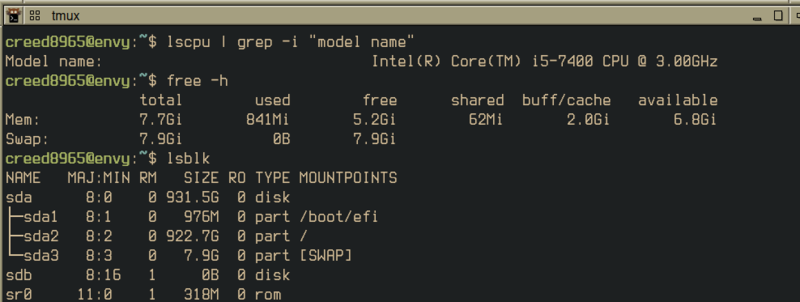

On this 8 GB RAM system, I can run 10+ containerized resources as opposed to 3-4 Virtual Machines. 

## 2. Debian login using ssh

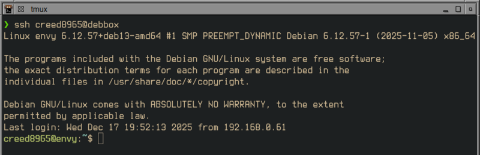

### ssh setup

One time setup is done using `ssh-copy-id`, using the pattern `username@device-ip`.

## 3. What is the IP address of the Debian Server?

`ip a` is the shorthand for `ip addr`, and must be piped through `grep` in order to show the ip starting with `192.168`.

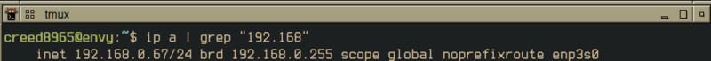

## 4. Firewall commands

### iptables

**Description**: Utility program that allows configuration of IP packet filter rules of the kernel firewall, implemented as different Netfilter modules.

#### Check firewall rules

```
sudo iptables -L -v -n
```
> List firewall managed ports `-L`, verbose `-v`, and in numeric order `-n`.


#### Disable firewall

```
sudo iptables -F INPUT
sudo iptables -P INPUT ACCEPT
```
`-F INPUT` flushes all rules in INPUT chain, clearing whitelist.

`-P INPUT ACCEPT` sets policy as permissive, allowing all inbound traffic, disabling the firewall.


#### Add to firewall?

To add a service to the firewall, namely Traefik, we have to explicitly allow `INPUT` over `tcp`.

##### Local traefik dashboard port

```
sudo iptables -A INPUT -p tcp --dport 8080 -j ACCEPT
```

##### Locally hosted Traefik site port

```
sudo iptables -A INPUT -p tcp --dport 80 -j ACCEPT
```

In my setup, Traefik handles HTTP routing via Docker's internal network. To route externally, the connection goes through Cloudflare tunnel allowing for no exposed ports to the internet.

This `iptables` rule will allow for localhost development and basic monitoring via the Traefik dashboard.

```
sudo apt install iptables-persistent
sudo netfilter-persistent save
```

The plugin `iptables-persistent` saves netfilter rules between reboots.

## 5. Commands used with Traefik

### What is the command you use to check if Traefik / Bookstack is running?

```
docker ps | grep -e "traefik" -e "bookstack"
```

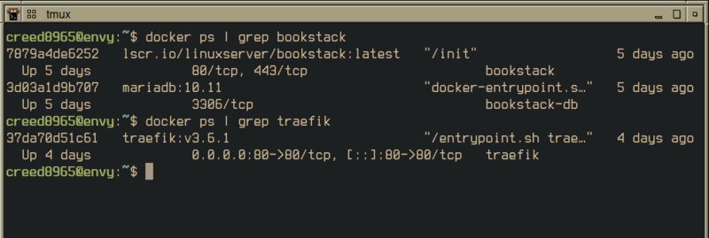

`ps` option lists details such as container ID, image name, status, and ports.


### What is the command you use to stop containers?

In the directory containing `docker-compose.yml` for a specific service:

```
docker compose down
```

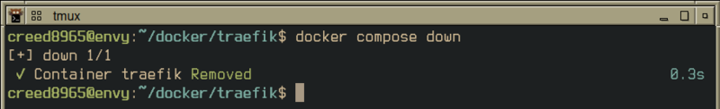

`compose` is used for starting, stopping, restarting containers. 

`down` brings the entire container down, removing all networks, as opposed to `stop` which keeps network and data, and turns off the container. 

### What is the command you use to restart Traefik?

In the directory container `docker-compose.yml`:

```
docker compose restart
```

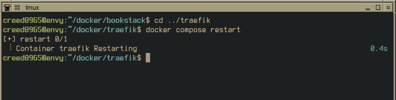

Brings down the container, then starts it after full shutdown.


### What is the command used to test Traefik configuration?

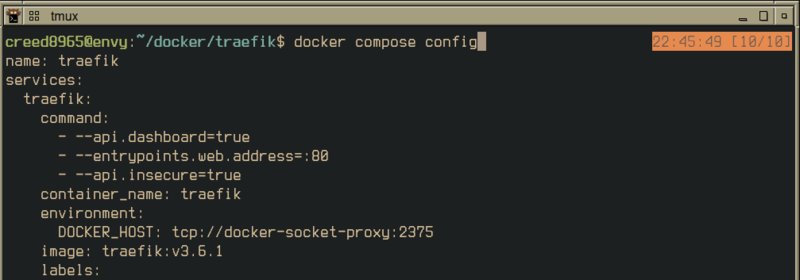

`docker compose config` dry runs, and an error in the `docker-compose.yml` exits with error message if broken.

### What is the command used to check the installed version of Traefik?

```
docker exec traefik traefik version
```
Prints version information using `traefik` inside the `traefik` container. 

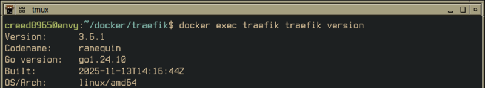

### What are some common configuration files for Traefik?


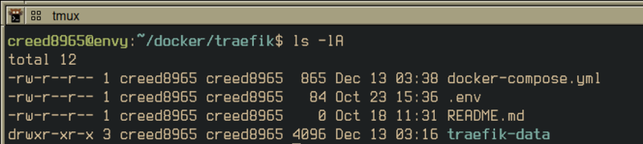

Docker uses **YAML** files for configuration. Assignment of ports, version, image, etc are all in `docker-compose.yml`

### Where does Traefik store logs?

Manually set up Traefik to store logs in the container's `/var/logs/traefik/{access,traefik}.log`, using the host machine's  `./traefik-data/traefik.yml`

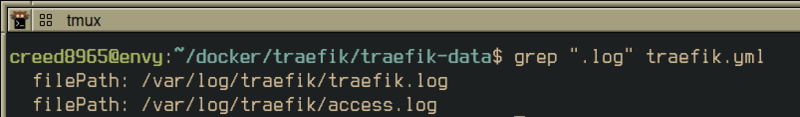

### What are some basic commands we can use to review logs?

To view logs, use `docker exec` to use commands inside `traefik` container:

```
docker exec traefik tail -5 /var/log/traefik/{access,traefik}.log
```
This will print the `tail` for both `traefik.log` and `access.log`. 

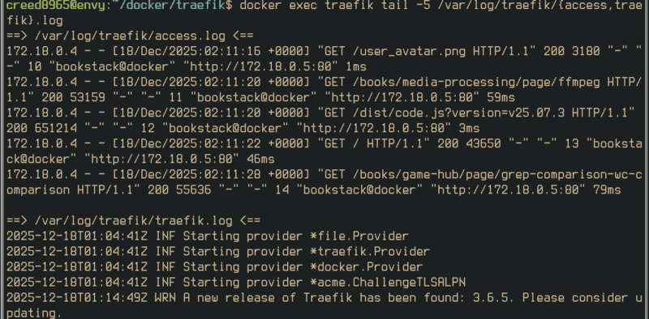


