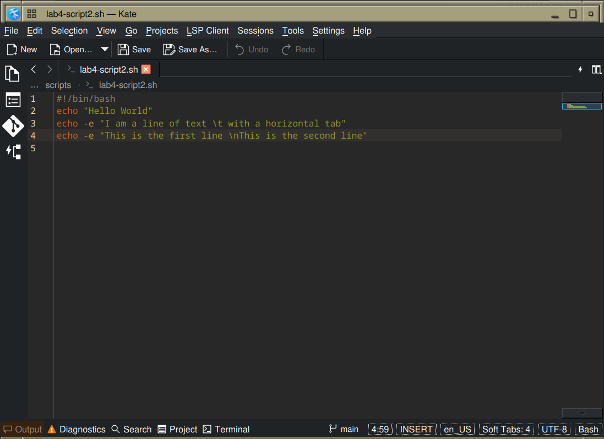

# Lab 4 Submission
*This lab was completed in Fedora Linux using DNF package manager instead of APT.*
## Using DNF
### q1.1

Searched for 'falling' games as Tetris-specific packages are limited in Fedora repos. Results demonstrate DNF search functionality.

### q1.2

Used ltris and kblocks as available block-game alternatives to demonstrate install/remove operations, since tetris was not found in any matched fields.

### q1.3

### q1.4

`dnf` does not ship with  `autoclean` and `autopurge`

`dnf clean all` cleans the cache.  

### q2.1

### q2.2

### q2.3

### Challenge Question

