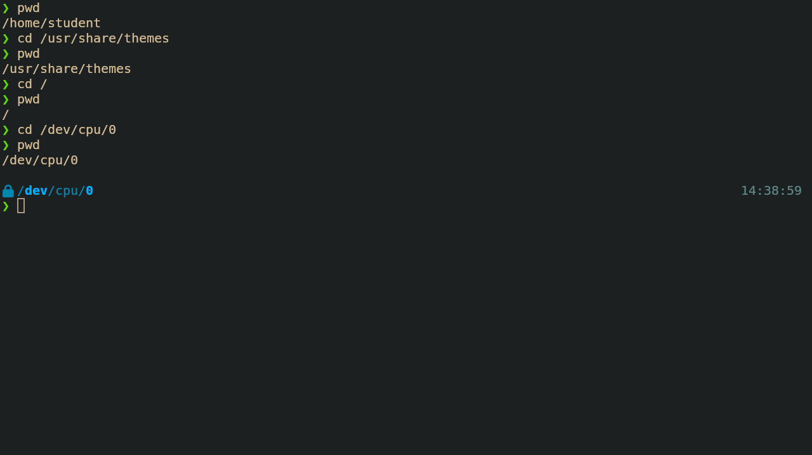
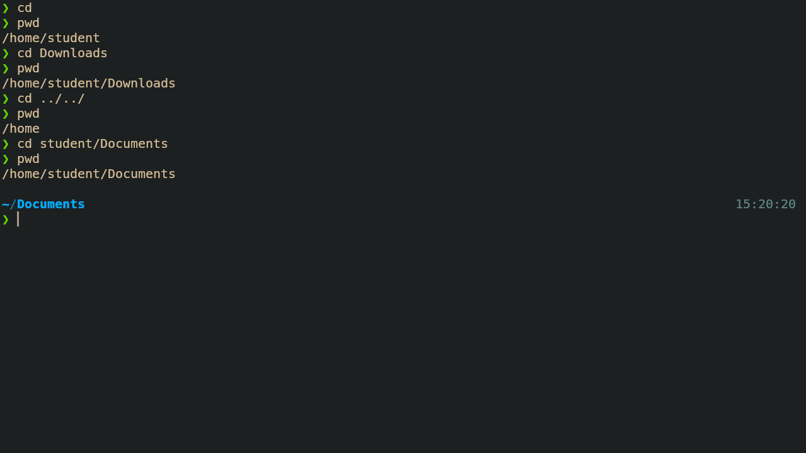
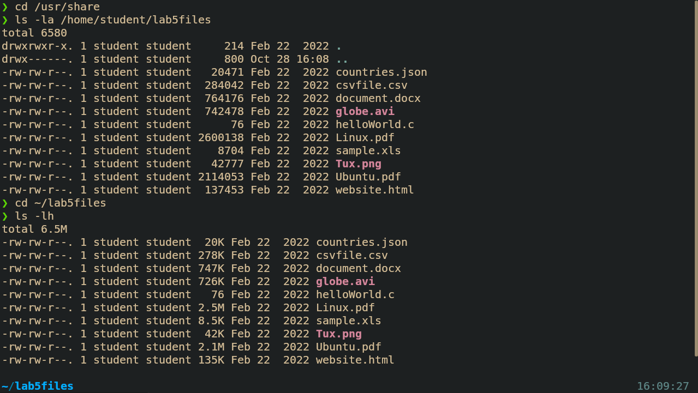
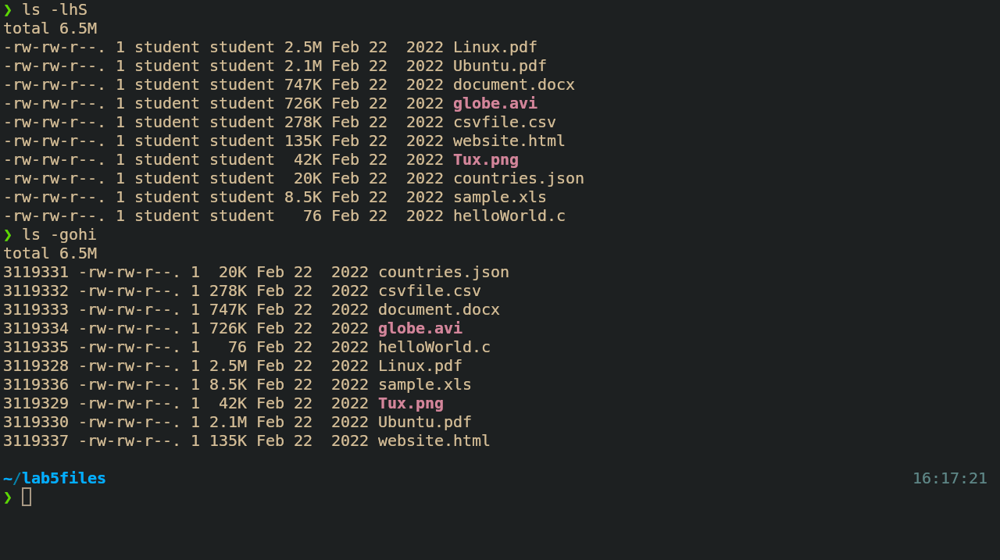
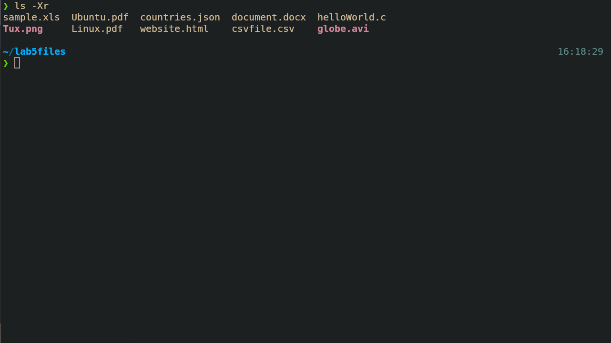
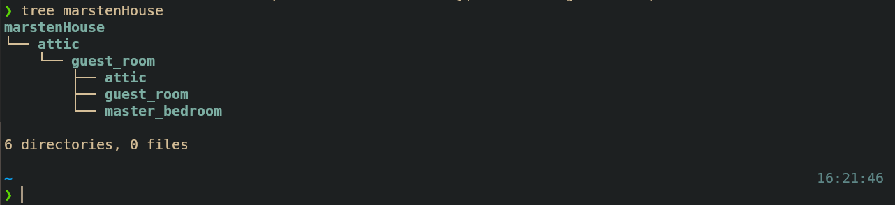
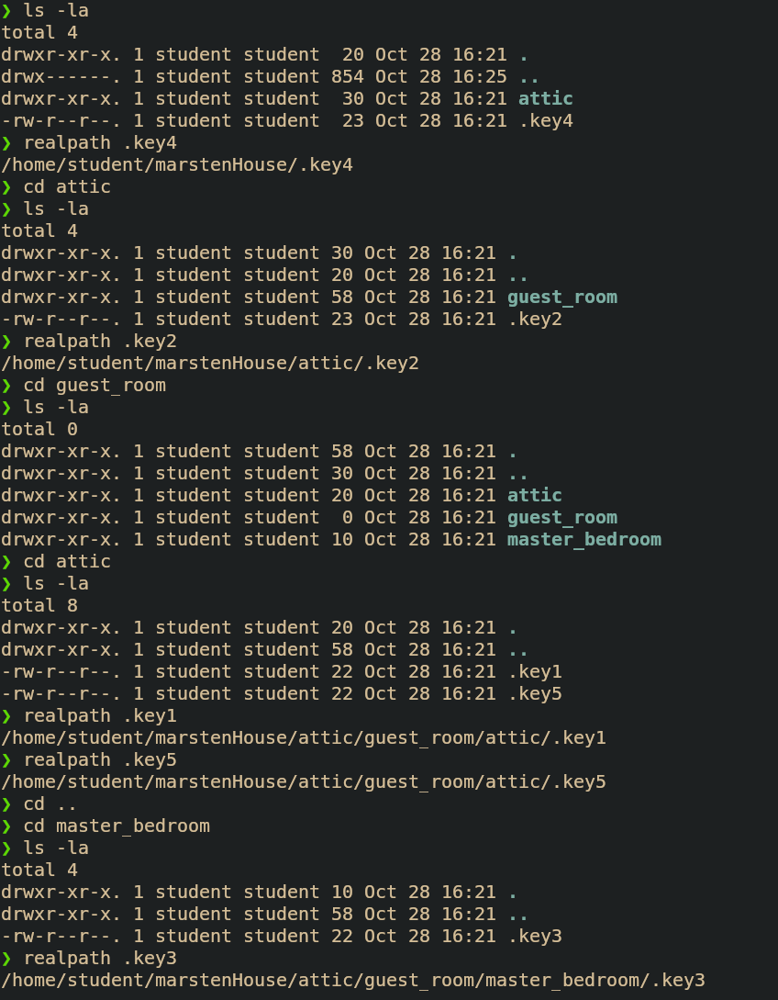

# Lab 5 Submission
## Linux File System
### q1.1 - Moving around the file system

### q1.2 - Moving around the file system

### q2 - Moving around the file system
##### Absolute path List and Long List

##### Sorted long list and Username + group removed, inode number

##### File extension list reverse order

### q3 - Challenge Question
#### Marsten House
##### House Map

##### Key absolute paths
