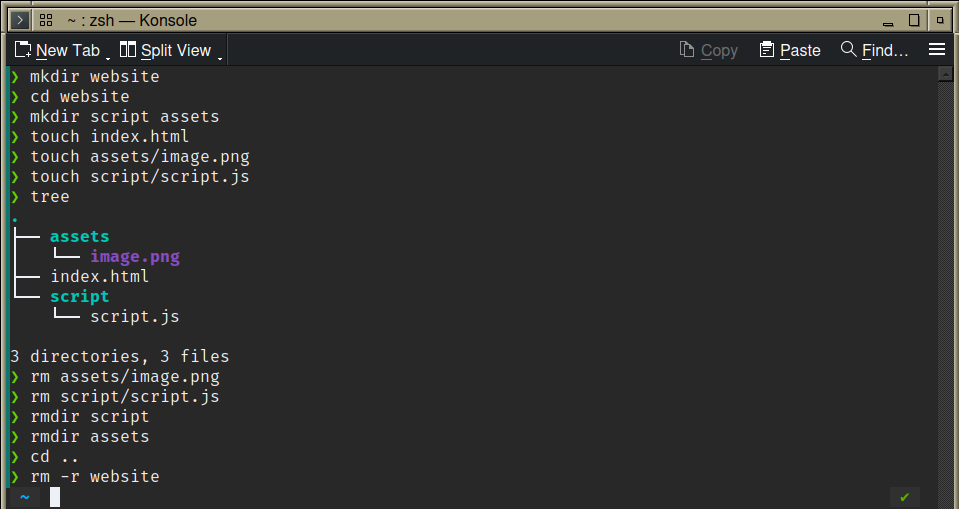
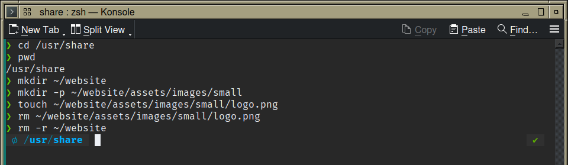
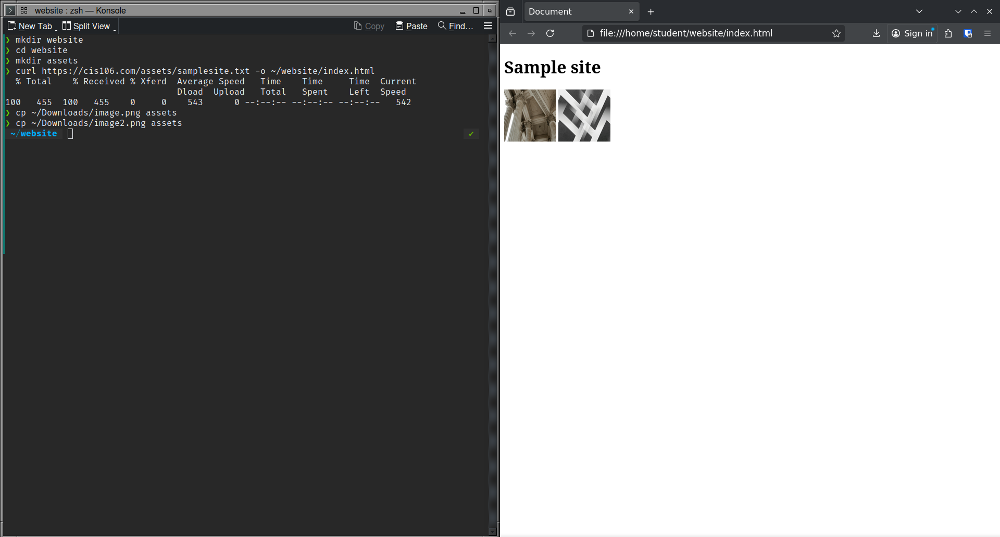
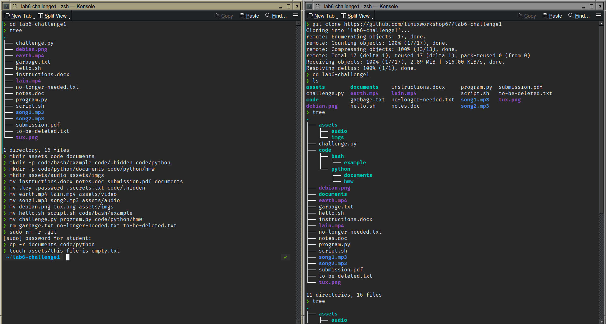
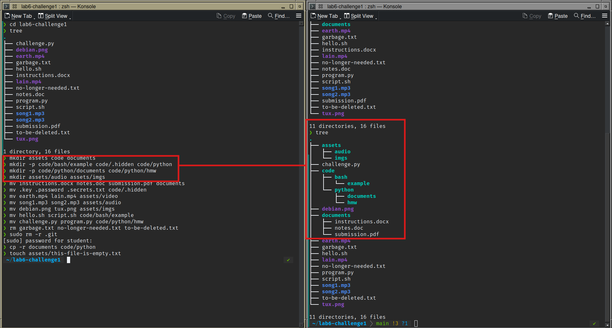
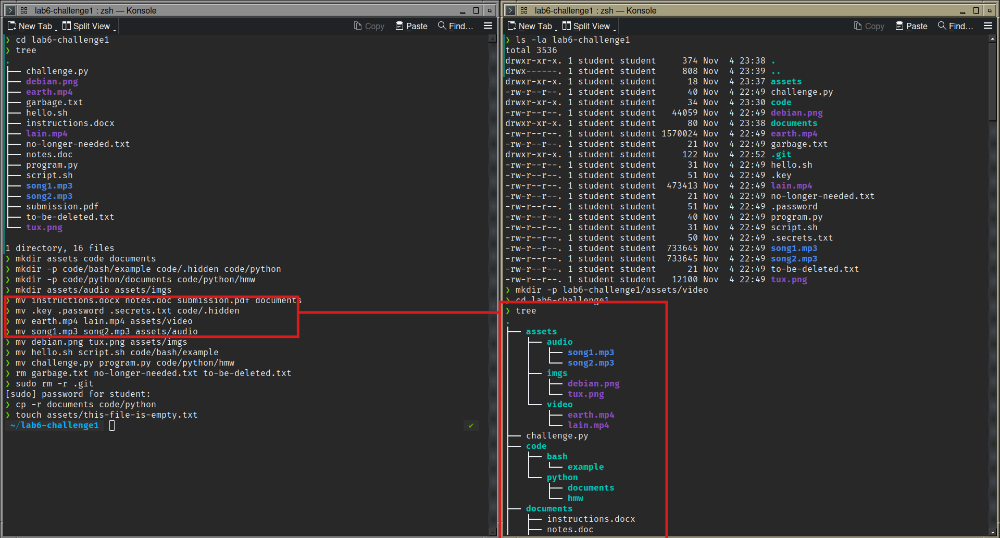
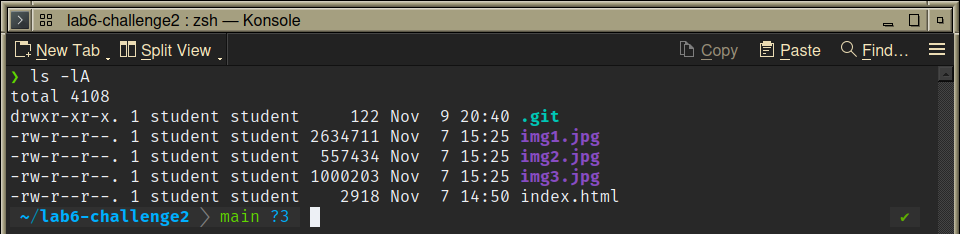

# Lab 6 Submission
## Managing files and directories
### q1.1 - Creating files and directories

### q1.2 - Creating files with parents

### q1.3 - Using curl and cp

## Challenge Question 1 - Organizing filetree

### git clone and initial state

### Creating Subdirectories
 
### Moving files

### Removing hidden and trash files, copying documents, making empty file

## Challenge Question 2 - Web Development 

