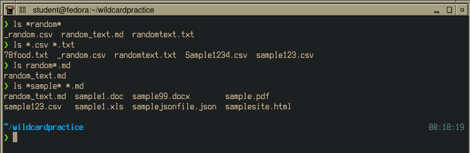
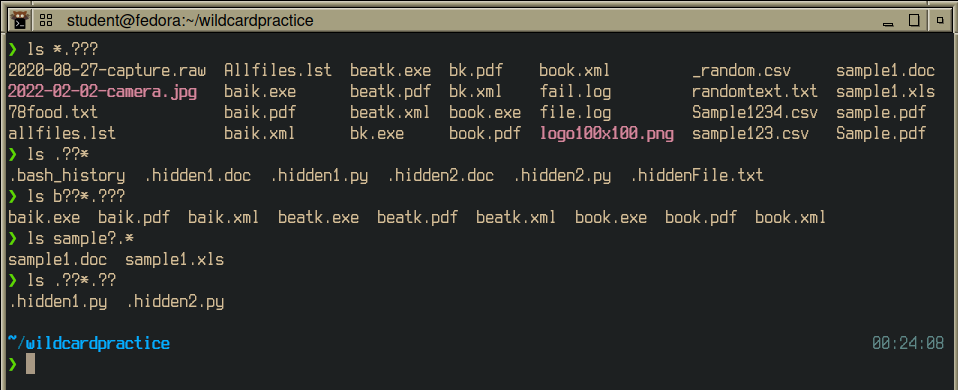
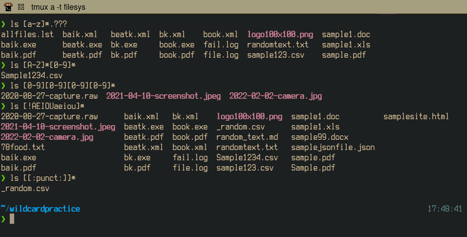
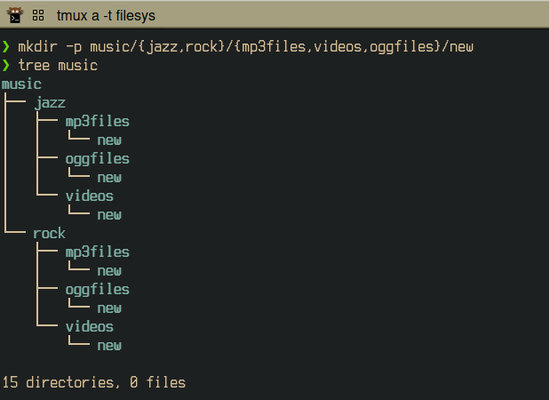
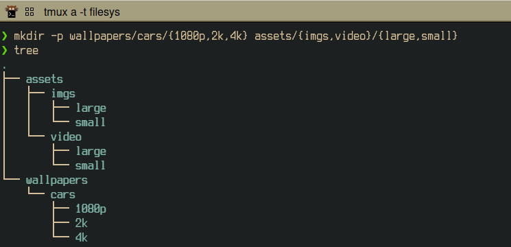
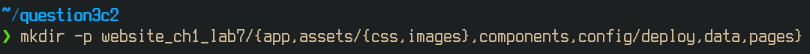
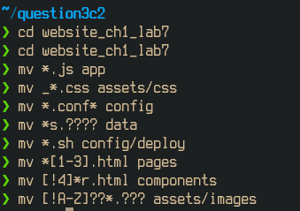
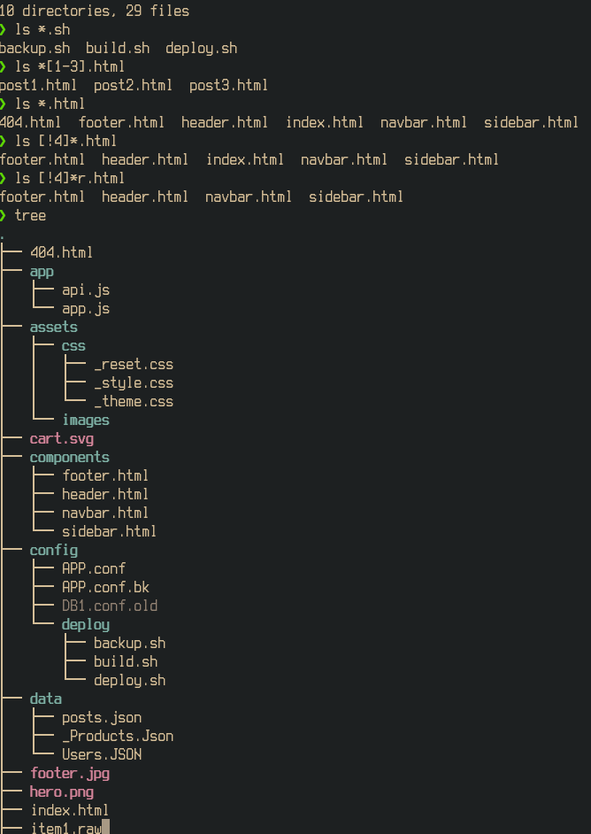
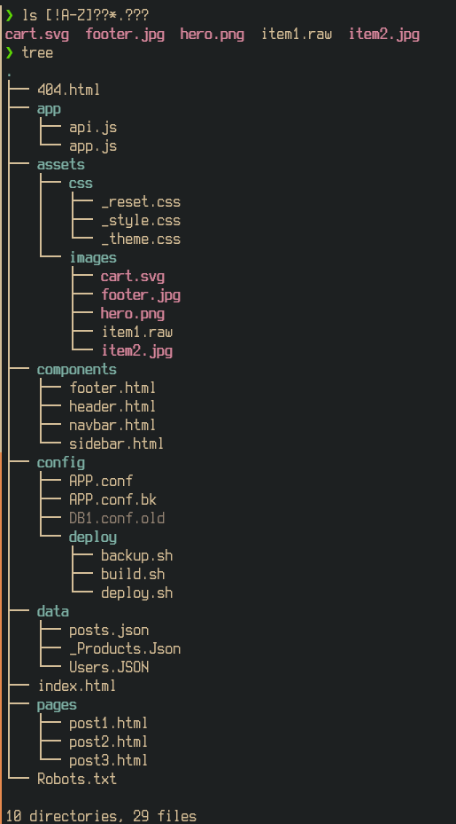

# Lab 7 Submission

## Question 1 Practice
### Practice 1

### Practice 2

### Practice 3

### Practice 4

## Question 2 Challenge 1

## Question 3 Challenge 2

### Initial subdirectory creation

### Subdirectory check

### Full list of commands used to move files

### Checks done before doing `mv` operations

### Final `tree` output

