# Lab 8

## Practice Exercises
### Practice 1 

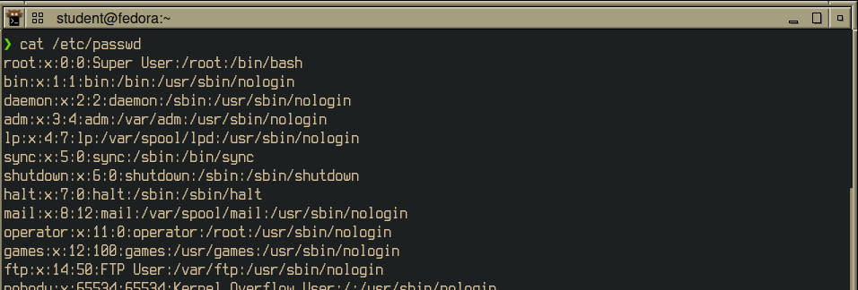
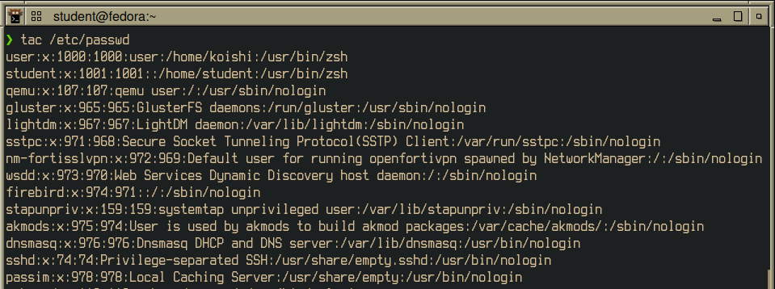
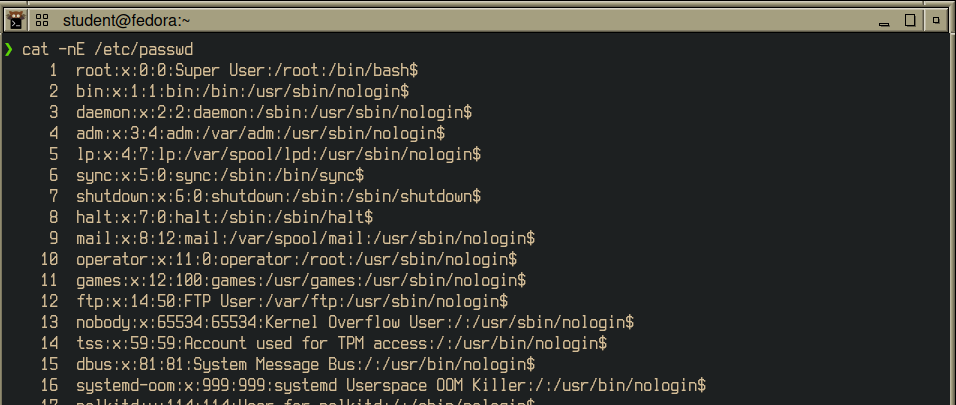
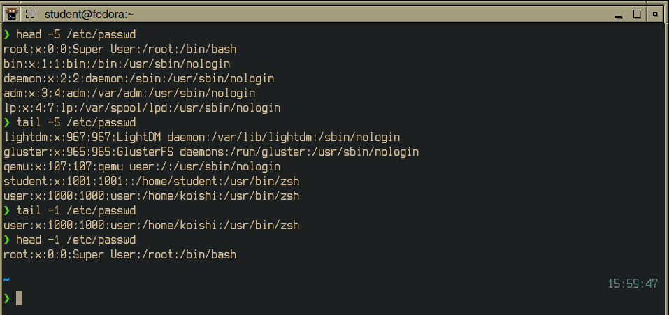
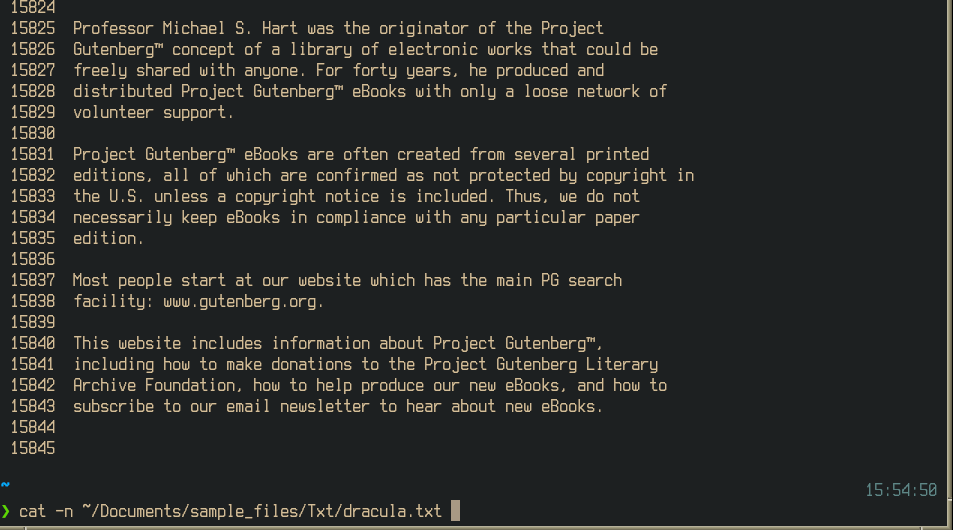

### Practice 2 

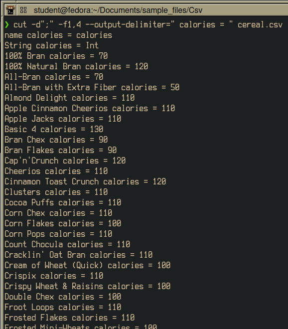

### Practice 3

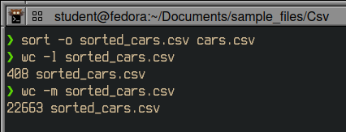

## Challenge

### Amount of logs in file

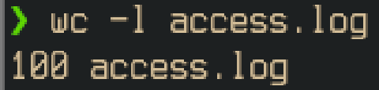

### First user to interact with application

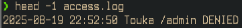

### Last user to interact with application

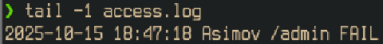

### First 15 events in file

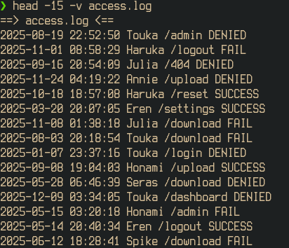

### Last 15 events in file

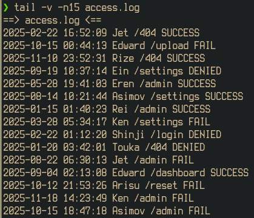

### All users that logged an event

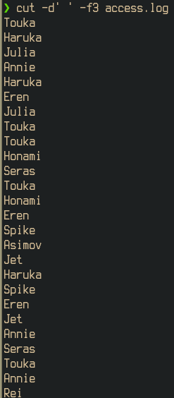

### Alphabetically ordered username log, saved file

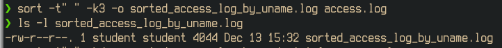

### Alphabetically ordered endpoint log, saved file

#### Logfile Checks

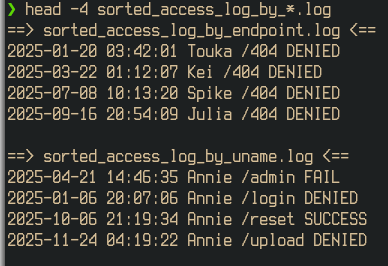

### Access delimiter command

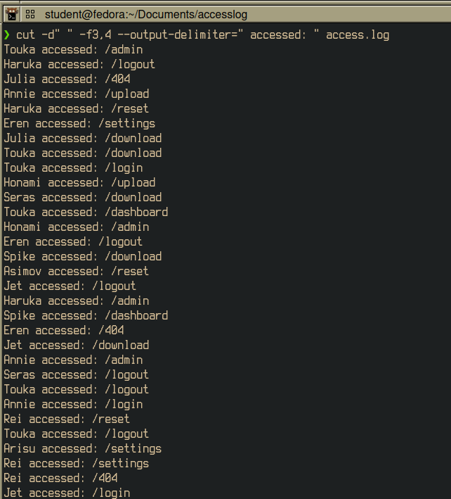

