# Lab 9
## Handling Text Files Part 2

### Question 1

#### Creating a home dir file report

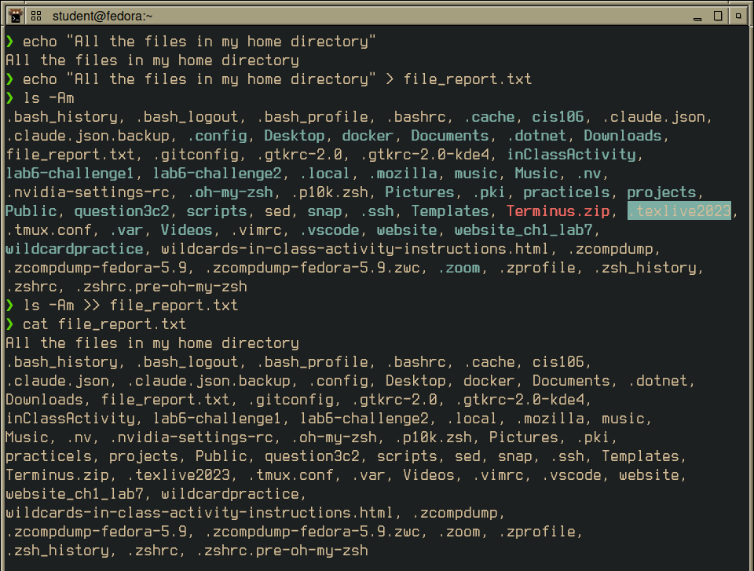

### Question 2

#### Number of files in home directory

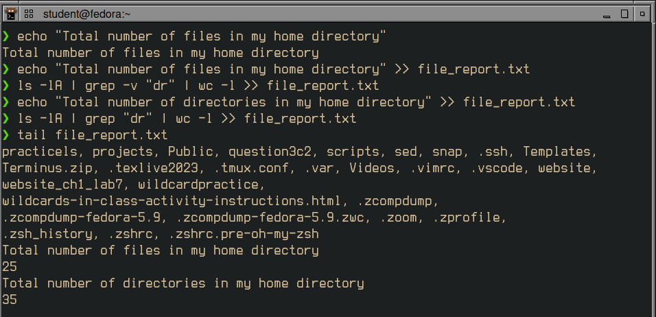
> Appending `echo`, linecount `wc -l` for inversion of grep of `dr` for directories
> linecount for directories using regular `grep`

### Question 3

#### Account field from `/etc/passwd` file

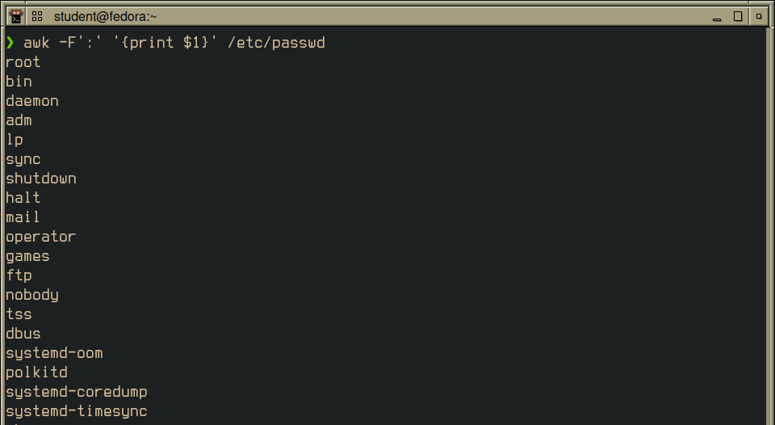

#### Account and shell fields

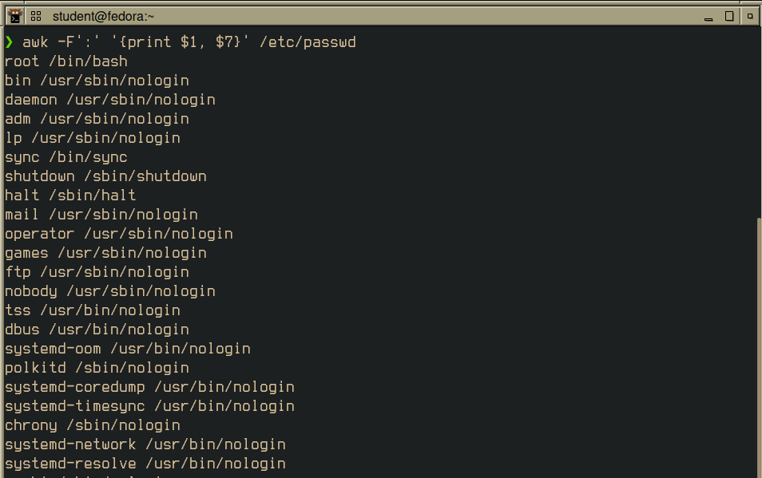

#### Account, shell, and home fields

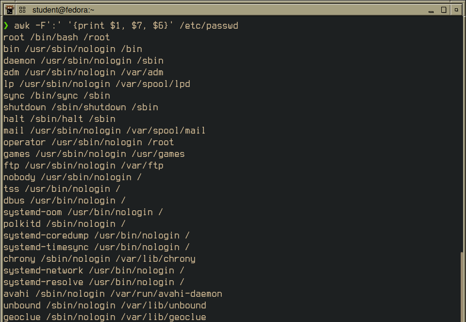

#### Separated with labels

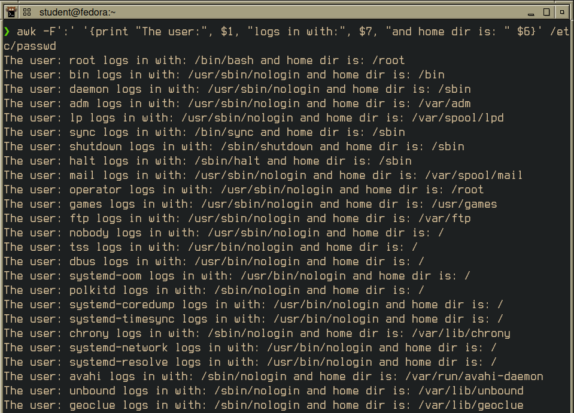

#### Extracting 

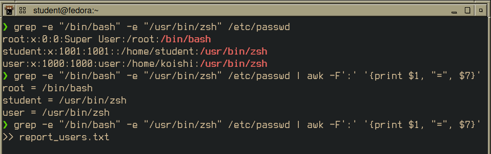
> Includes `/usr/bin/zsh` to account for user assigned shell

#### Report users check

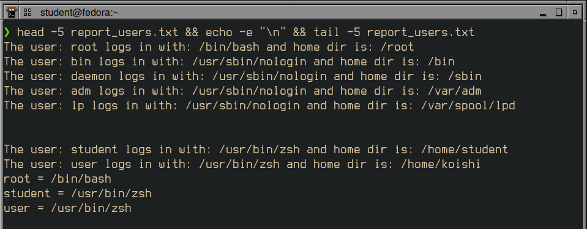

### Question 4

#### Creating honda1.csv

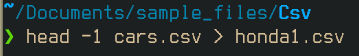

#### Check honda1.csv header

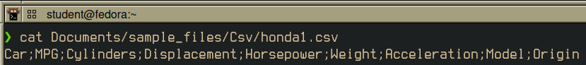

#### Move all containing "honda"

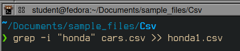
> case insensitive `-i`

#### Check honda1.csv

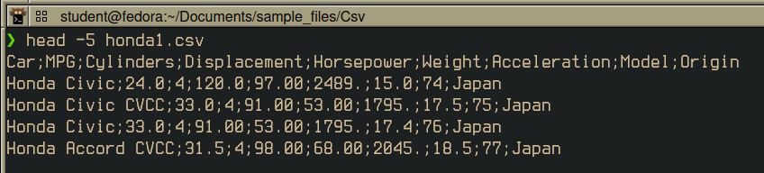

#### Replace ; with , and check

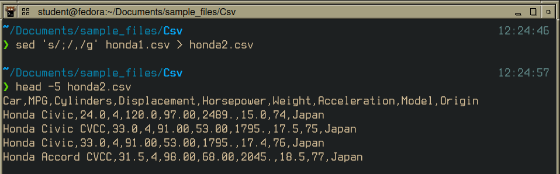

#### Initialize honda3.csv with header

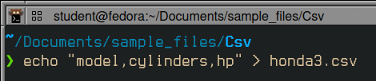

#### Pipe without 1st line, print comma separated fields

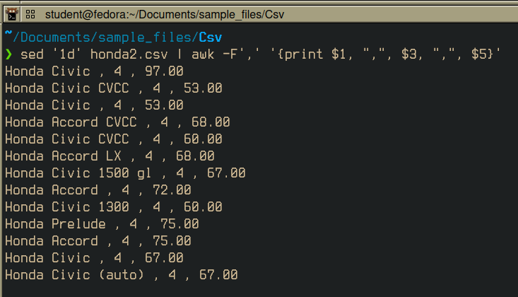

#### Delete spaces

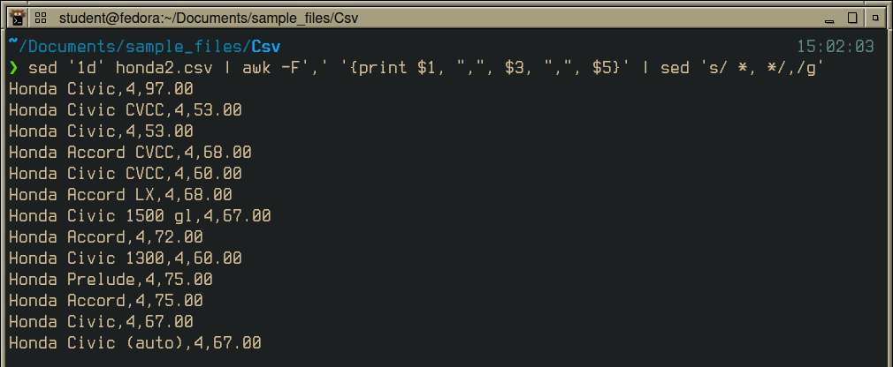

> Uses `*` to match preceding item 

#### Replace `Honda ` with `Honda_`

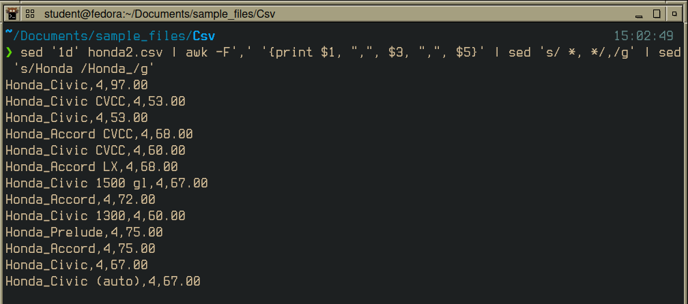

#### Append to honda3.csv

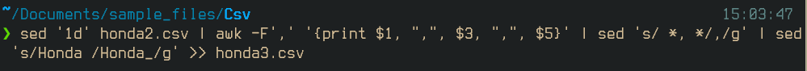

#### Install `bat`

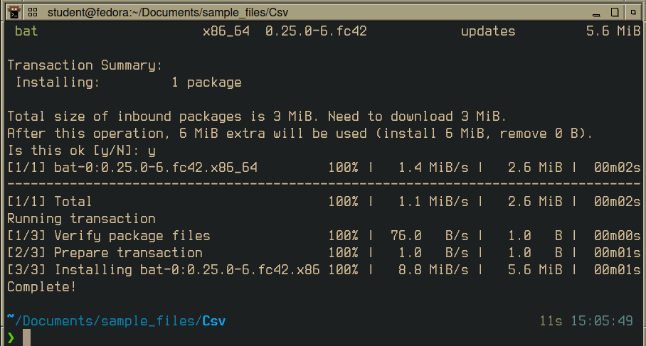

#### Check with `bat`

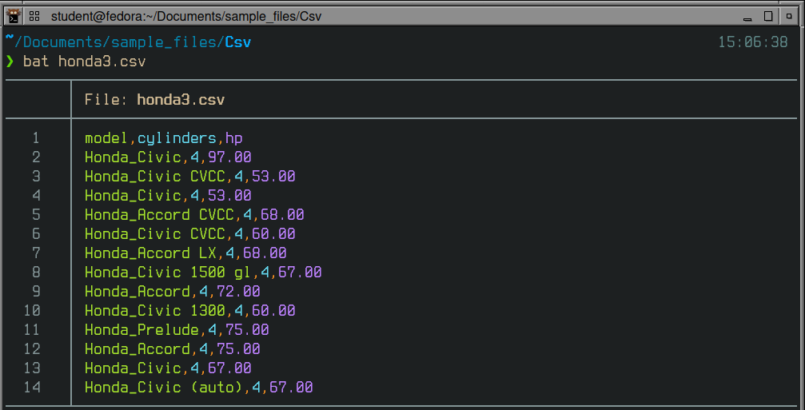

### Challenge Question

#### grep for href= and src=

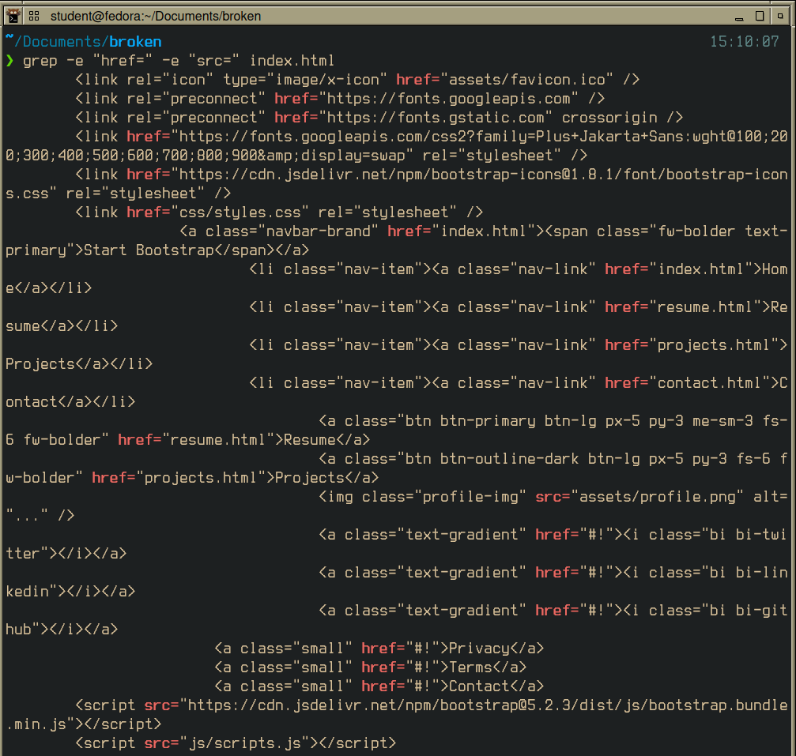

#### Filter placeholders and http links

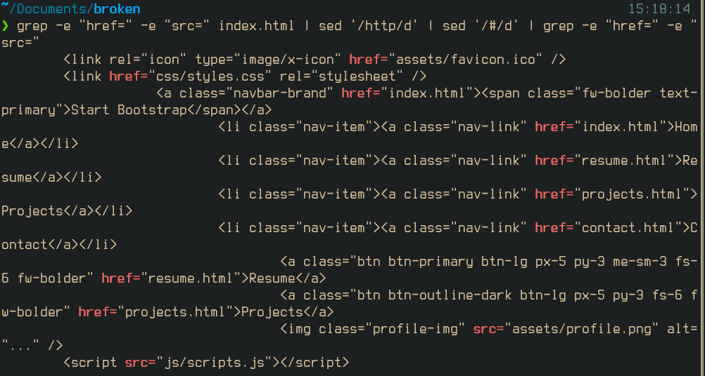

#### File reconnaissance

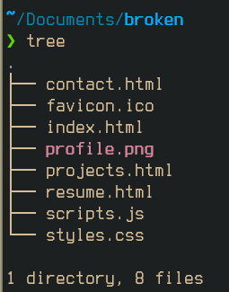

#### Creating directories and moving files to proper dir

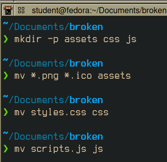

#### Checking `index.html` in firefox

