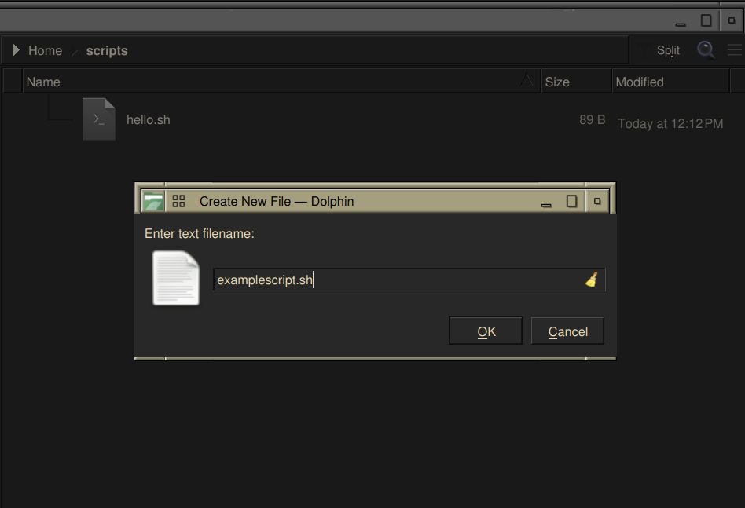
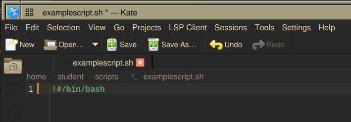
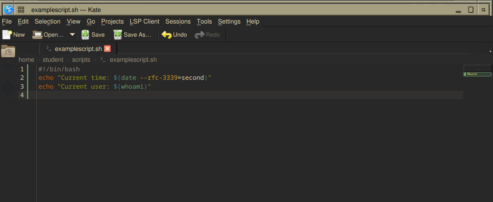
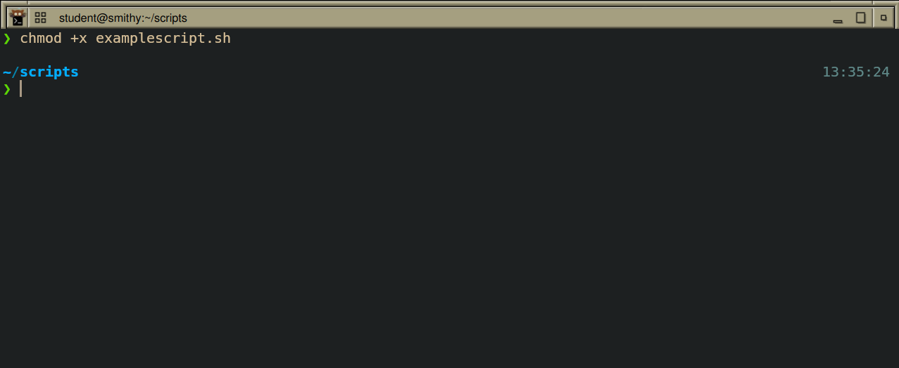
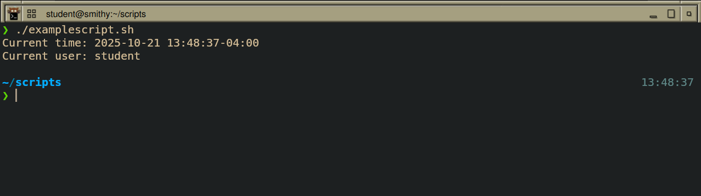

# How to install and remove software

### What is the difference between APT and DNF?

APT and DNF are package managers for different Linux distribution families. APT is Debian/Ubuntu's, using .deb packages, while DNF is Fedora/RHEL/CentOS and uses .rpm packages.

## Installing software

### How do you find software?
```
dnf search package

package-name.x86-64            Package that does...
```

In both `dnf` and `apt`, you can use the `search` feature in order to find specific software or packages.

### How do you install software?
```
sudo dnf install package-name
[sudo] password for user:
(installation process)
Complete!
```

Using the name found in `search`, `install` to download and install the specified package with dependencies. This requires `sudo` privileges. 

### How do you remove software?


#### Removal

```
sudo dnf remove package-name
```

To remove a package, use `remove`, though this retains config files.

#### Cache Cleaning
```
sudo dnf clean all && sudo dnf autoremove
```
These two commands clear the package cache and removes unnecessary dependencies.

## Shell Scripting

### Step 1: Create the Script File
Create a file with the `.sh` extension:



### Step 2: Add the Shebang
Open the file in a text editor and add the shebang line as the first line:



This tells the system to execute the script using the Bash interpreter located at `/bin/bash`.

### Step 3: Add Commands
Write your commands line by line, just as you would in the terminal:



### Step 4: Make it Executable
Before running the script, give it execute permissions:



### Step 5: Run the script

Execute the script using `./`:

