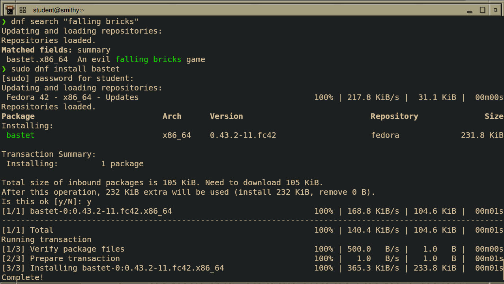
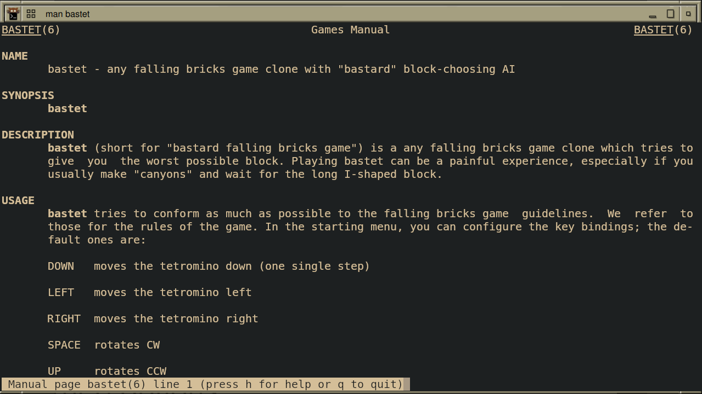
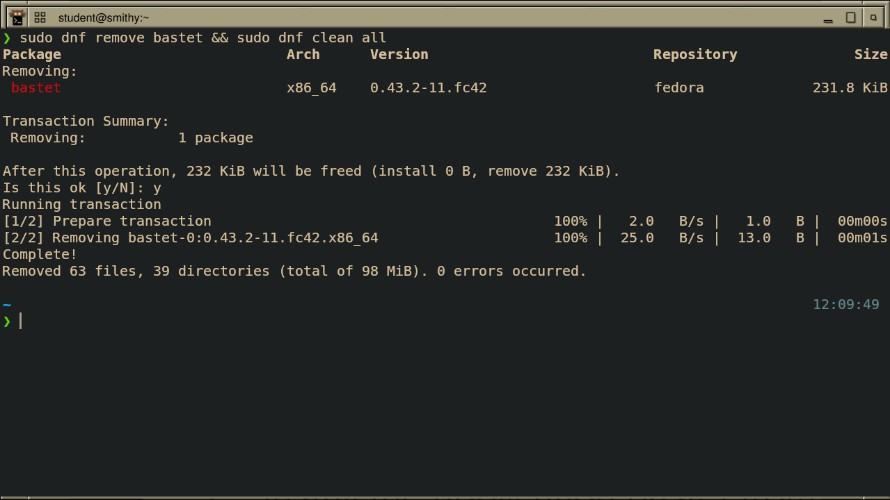
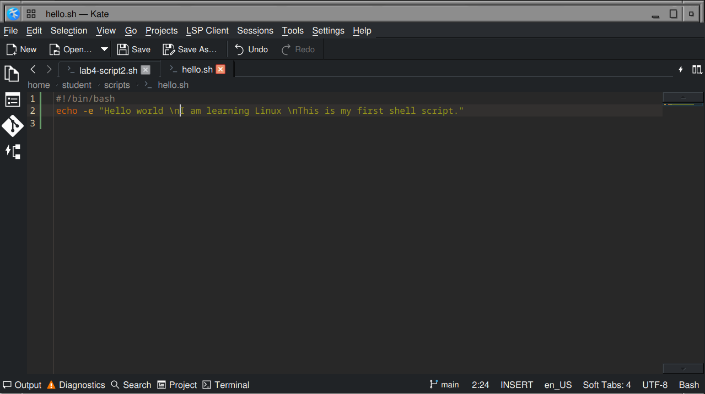
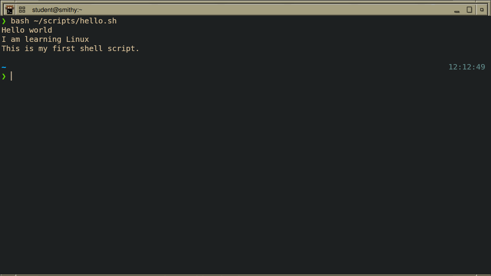

# Week Report 4
## Completed work for week 4:

- [Lab 4](https://github.com/perronejon/cis106/blob/main/labs/lab4/lab4.md)
- [Notes 4](https://github.com/perronejon/cis106/blob/main/notes/notes4/notes4.md)

## Practice Screenshots

### Managing Software Practice 1

#### DNF Search & Install

#### Manual page for application

#### Remove and clean

### Shell Scripting Practice 1

#### Writing the Script

#### Executing the script

