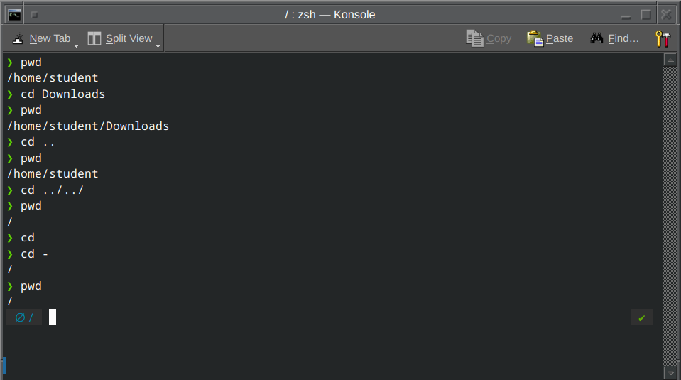
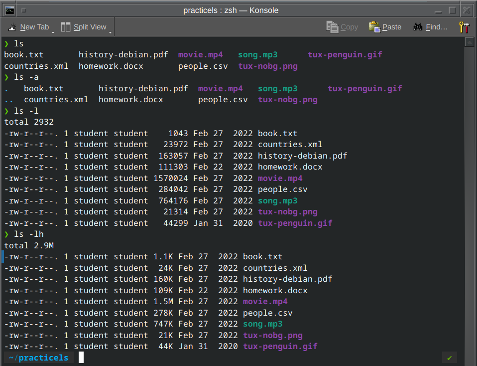
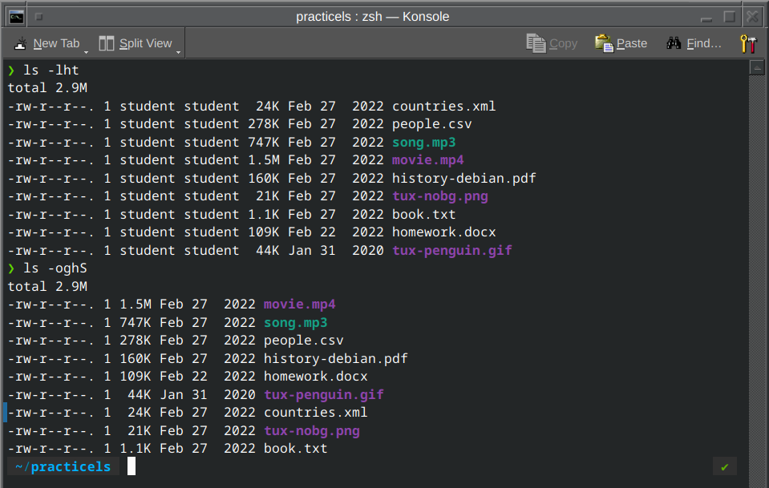
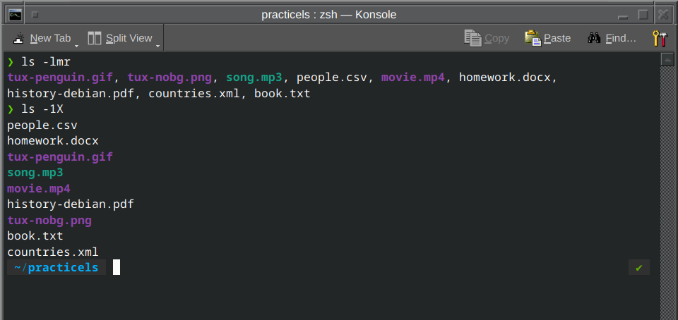
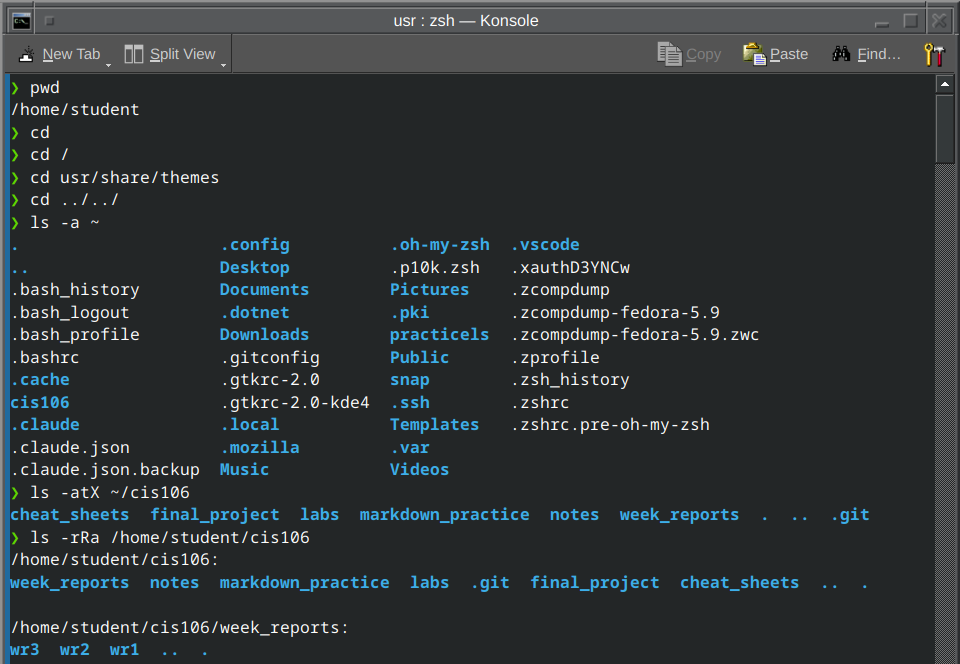
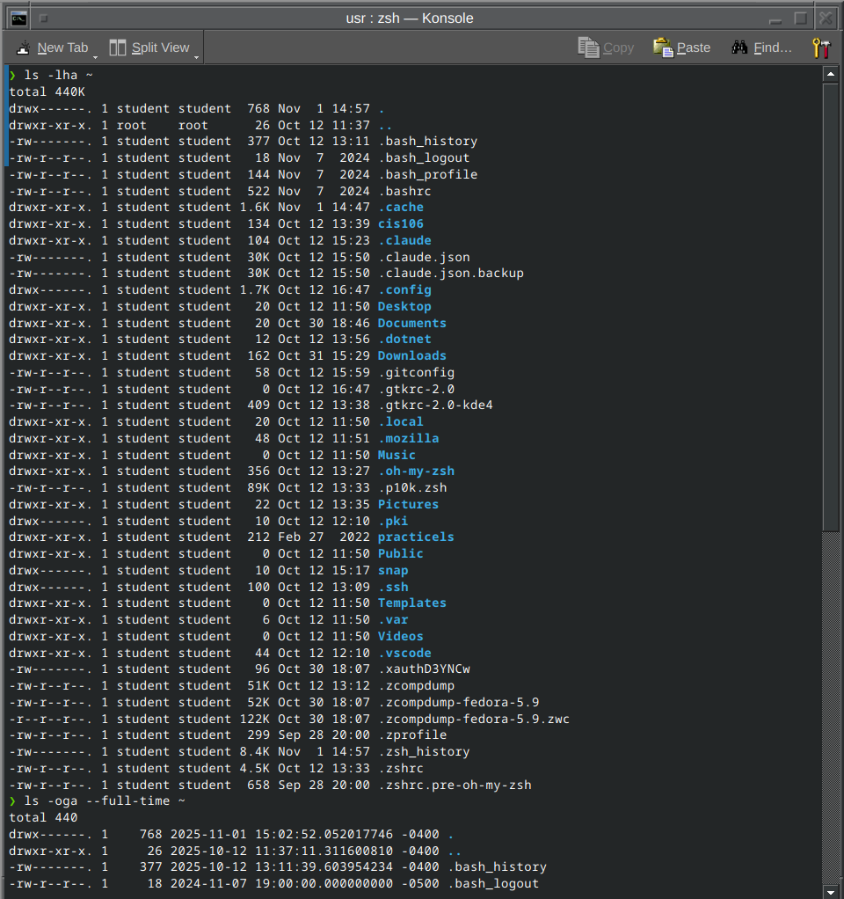
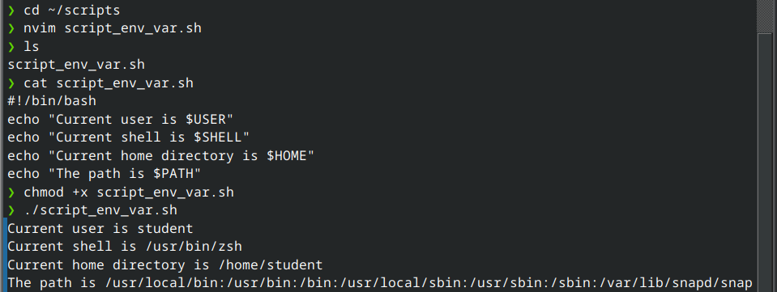

# Week Report 5
## Completed work for week 5:

- [Lab 5](https://github.com/perronejon/cis106/blob/main/labs/lab5/lab5.md)
- [Notes 5](https://github.com/perronejon/cis106/blob/main/notes/notes5/notes5.md)

## Practice Screenshots

### Linux Filesystem

#### Practice 1

#### Practice 2

#### Practice 3

### Shell Scripting Practice 1

#### env Variable practice

#### User variable practice

